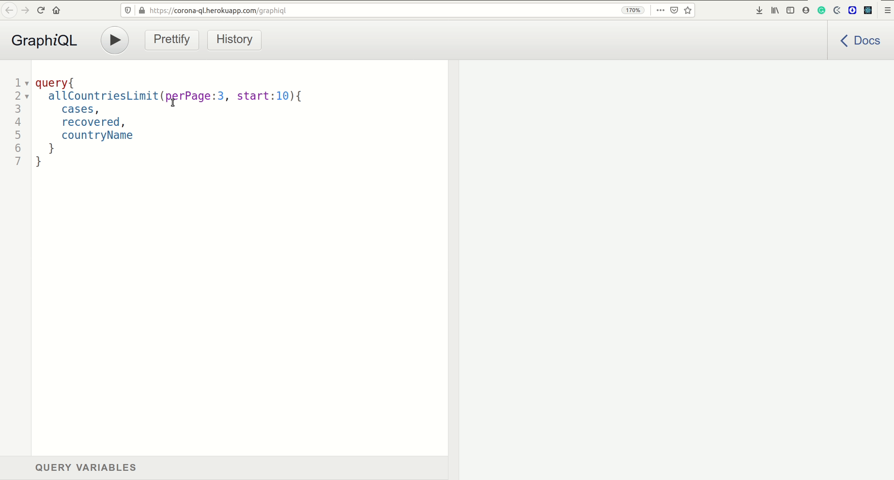

# CoronaQL

> This is a live tracker for #COVID-19 / Coronavirus cases worldwide. This tracker is built on Rails with GraphQL endpoints. You can use this tracker to supply data to your web/mobile apps.


## Video demo


## Built With

- Rails
- GraphQL
- GraphiQL
- HTTParty

## Live Demo/GraphiQL playground

[GraphiQL playground](https://corona-ql.herokuapp.com/graphiql)

## API Endpoints

- To return each country(in ascending order) in the db, use the query below. This query includes all the possible fields.

```
query{
  allCountries{
    countryName,
    cases,
    casesToday,
    deaths,
    deathsToday,
    recovered,
    active,
    critical
  }
}
```

- To perform a wildcard search through the records, use the text argument in the countryFilter query.

```
query{
  countryFilter(text: "NIG"){
    countryName,
    cases
  }
}
```

- The query below will return 10 records starting from the first record. These are also the default values for the per_page and start arguments.

```
query{
  allCountriesLimit(perPage:10, start:1){
    countryName,
    cases,
    casesToday,
    deaths,
    deathsToday,
    recovered,
    active,
    critical
  }
}
```

- To find information about a specific country.

```
query{
  findCountry(countryName: "Nigeria"){
    casesToday,
    deaths,
    deathsToday,
    recovered
  }
}
```

- For a concise summary

```
query{
    summary{
        totalCases,
        totalDeaths,
        totalRecovered
    }
}
```

- To query this API from a frontend App, make a POST request in the following format. In development, use localhost:3000 instead of the URL below.

```
http://corona-ql.herokuapp.com/graphql?query={ summaries {totalCases, totalDeaths, totalRecovered}}
```

## Getting Started

**To get started, follow the instructions below**

To get a local copy up and running follow these simple example steps.

- git clone the repo

```
git clone https://github.com/onedebos/corona-ql.git
```

- Install the gems

```
bundle install
```

- create and migrate the db

```
rails db:create db:migrate
```

- run the seed file

```
rails db:seed
```

- run the rails server on port 3001

```
rails s
```

- You can test out some of the queries in the GraphiQL playground. Simply navigate to

```
http://localhost:3000/graphiql
```

### Prerequisites

- Rails 6
- Ruby 2.5.1

### Automated Tests
- Currently, there are no automated tests avaailable for this project. This will be implemented at a later date.

## Planned Features
- API should receive data from the WorldOmeters website directly. 

## Authors

👤 **Adebola**

- Github: [@githubhandle](https://github.com/onedebos)
- Twitter: [@twitterhandle](https://twitter.com/debosthefirst)
- Linkedin: [linkedin](https://www.linkedin.com/in/adebola-niran/)

## 🤝 Contributing

Contributions, issues and feature requests are welcome!

Feel free to check the [issues page](issues/).

## Show your support

Give a ⭐️ if you like this project!

## Acknowledgments

- Thanks to [Novel COVID19](https://github.com/NovelCOVID/API) for the orignal API that this is built off from.

## 📝 License

This project is [MIT](lic.url) licensed.
